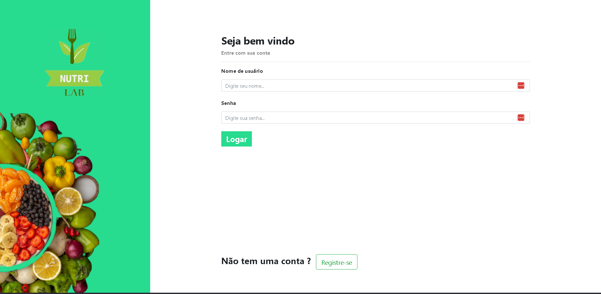

# NUTRI_LAB

O projeto tem como objetivo de cadastrar e logar nutricionistas, para que possa adicionar seus pacientes e colocando seus dados no site, observando suas progressões. Tudo isso feito com Django

___

___

## Tecnologias 🖥️

- Python
- Bootstrap
- Django
- SQLite
- Git e Github

___

## Contato ✉️

matheusssalmeida@yahoo.com.br